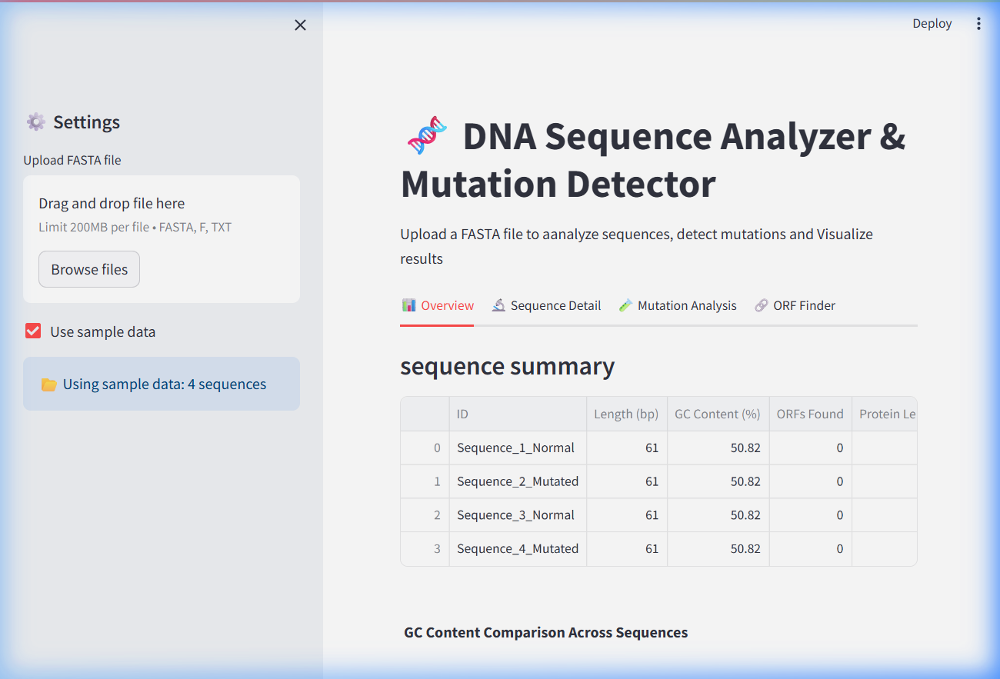
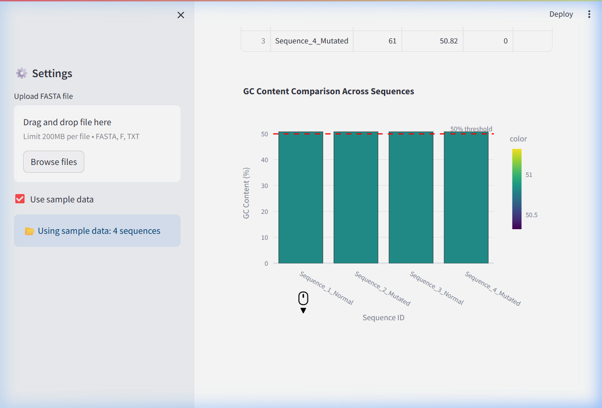
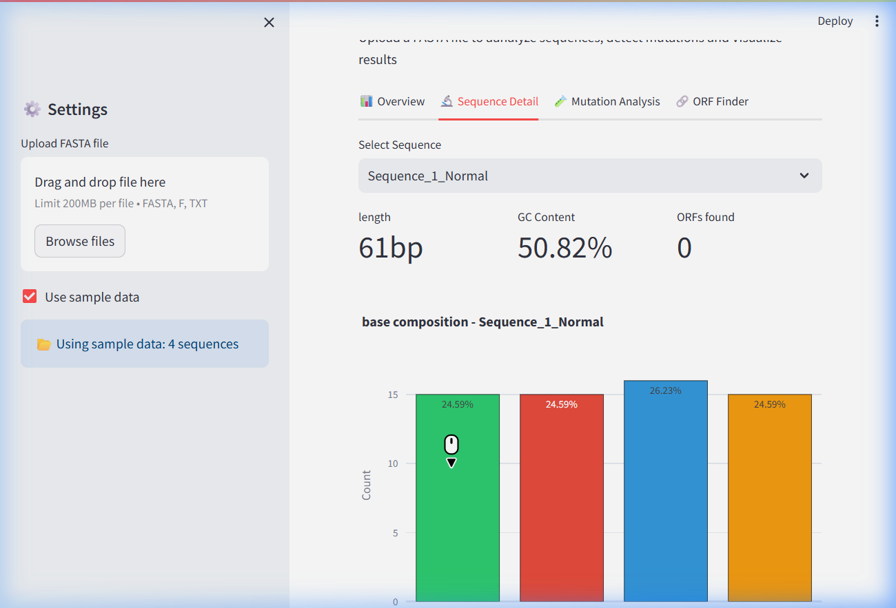
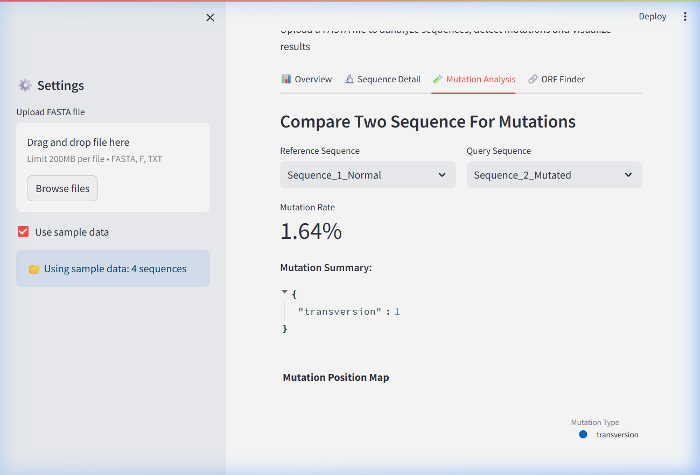
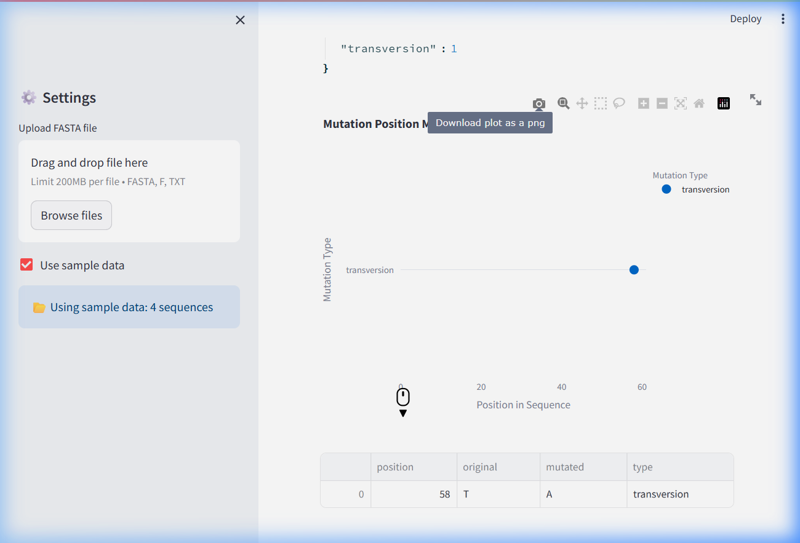
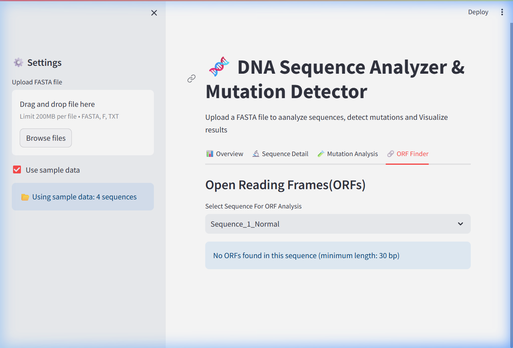

# 🧬 DNA Sequence Analyzer & Mutation Detector

[](https://python.org)
[](https://streamlit.io)
[](https://plotly.com)
[](https://biopython.org)
[](LICENSE)

An interactive bioinformatics web application for analyzing DNA sequences, detecting point mutations, and visualizing genomic data — built with **Streamlit**, **Biopython**, and **Plotly**.

Upload any FASTA file and instantly get GC content analysis, base composition charts, mutation detection between sequences, protein translation, and Open Reading Frame (ORF) discovery.

---

## ✨ Features

| Feature | Description |
|---------|-------------|
| 📊 **Sequence Overview** | Summary table with length, GC%, ORF count, and protein length for all loaded sequences |
| 📈 **GC Content Comparison** | Interactive bar chart comparing GC content across sequences with a 50% threshold line |
| 🔬 **Sequence Detail View** | Per-sequence metrics, color-coded base composition chart (A/T/G/C), and expandable viewers for raw sequence, reverse complement, and translated protein |
| 🧪 **Mutation Analysis** | Compare any two sequences to detect point mutations, classify them as transitions or transversions, and calculate mutation rates |
| 📍 **Mutation Position Map** | Scatter plot showing exact mutation positions along the sequence |
| 🔗 **ORF Finder** | Scans all three reading frames for Open Reading Frames (ATG→Stop), with horizontal bar chart visualization |
| 📁 **FASTA Upload** | Upload your own `.fasta`, `.fa`, or `.txt` files, or use the built-in sample data |

---

## 📸 Screenshots

### Overview Dashboard


### GC Content Comparison


### Sequence Detail


### Mutation Analysis


### Mutation Position Map


### ORF Finder


---

## 🚀 Getting Started

### Prerequisites

- Python 3.10 or higher
- pip (Python package manager)

### Installation

1. **Clone the repository**
   ```bash
   git clone https://github.com/YOUR_USERNAME/dna-sequence-analyzer.git
   cd dna-sequence-analyzer
   ```

2. **Create a virtual environment** (recommended)
   ```bash
   python -m venv venv
   source venv/bin/activate        # Linux/macOS
   venv\Scripts\activate           # Windows
   ```

3. **Install dependencies**
   ```bash
   pip install -r requirements.txt
   ```

4. **Run the app**
   ```bash
   streamlit run APP.py
   ```

5. **Open your browser** at `http://localhost:8501`

---

## 📁 Project Structure

```
dna-sequence-analyzer/
├── APP.py              # Main Streamlit application (UI & layout)
├── Sequence.py         # DNA sequence parsing, analysis & translation
├── mutation.py         # Point mutation detection & classification
├── visualizer.py       # Plotly chart generation functions
├── sample.fasta        # Sample FASTA file with 4 DNA sequences
├── requirements.txt    # Python dependencies
├── screenshots/        # App screenshots for documentation
├── LICENSE             # MIT License
└── README.md           # This file
```

---

## 🧪 How It Works

### Sequence Analysis Pipeline

```
FASTA File → Parse Sequences → Analyze Each Sequence
                                    ├── Calculate GC Content
                                    ├── Base Composition (A/T/G/C counts & %)
                                    ├── Find ORFs (3 reading frames)
                                    ├── Generate Complement & Reverse Complement
                                    └── Translate to Protein (from first ATG)
```

### Mutation Detection

```
Sequence A (Reference)  ──┐
                          ├── Pairwise Alignment → Detect Mismatches
Sequence B (Query)      ──┘        │
                                   ├── Classify: Transition or Transversion
                                   ├── Calculate Mutation Rate (%)
                                   └── Generate Position Map
```

### Key Concepts

| Term | Definition |
|------|------------|
| **GC Content** | Percentage of Guanine (G) + Cytosine (C) bases in a sequence. Higher GC = more thermally stable DNA |
| **Transition** | Mutation between same-type bases: Purine↔Purine (A↔G) or Pyrimidine↔Pyrimidine (C↔T) |
| **Transversion** | Mutation between different-type bases: Purine↔Pyrimidine (A↔C, G↔T, etc.) |
| **ORF** | Open Reading Frame — a stretch of DNA starting with ATG and ending with a stop codon (TAA/TAG/TGA) |
| **Reverse Complement** | The complementary DNA strand read in the 3'→5' direction |

---

## 🛠️ Tech Stack

- **[Streamlit](https://streamlit.io/)** — Interactive web app framework
- **[Biopython](https://biopython.org/)** — Biological sequence parsing & manipulation
- **[Plotly](https://plotly.com/)** — Interactive data visualizations
- **[Pandas](https://pandas.pydata.org/)** — Data manipulation & display

---

## 🌍 Real-World Applications

- **Clinical Genetics** — Identify disease-causing mutations by comparing patient DNA to reference genomes
- **Cancer Research** — Detect somatic mutations in tumor vs. normal tissue samples
- **Epidemiology** — Track viral mutations across pandemic variants (COVID-19, influenza)
- **Forensic Science** — Analyze SNP differences between DNA samples
- **Agriculture** — Compare crop cultivar genomes for trait-linked mutations
- **Drug Discovery** — Find ORFs encoding potential drug target proteins
- **Education** — Interactive tool for teaching molecular biology and bioinformatics

---

## 🤝 Contributing

Contributions are welcome! Feel free to:

1. Fork the repository
2. Create a feature branch (`git checkout -b feature/amazing-feature`)
3. Commit your changes (`git commit -m 'Add amazing feature'`)
4. Push to the branch (`git push origin feature/amazing-feature`)
5. Open a Pull Request

---

## 📄 License

This project is licensed under the MIT License — see the [LICENSE](LICENSE) file for details.

---

## 📬 Contact

If you have questions or suggestions, feel free to open an issue or reach out!

---

<p align="center">
  Made with ❤️ using Python, Streamlit & Biopython
</p>
